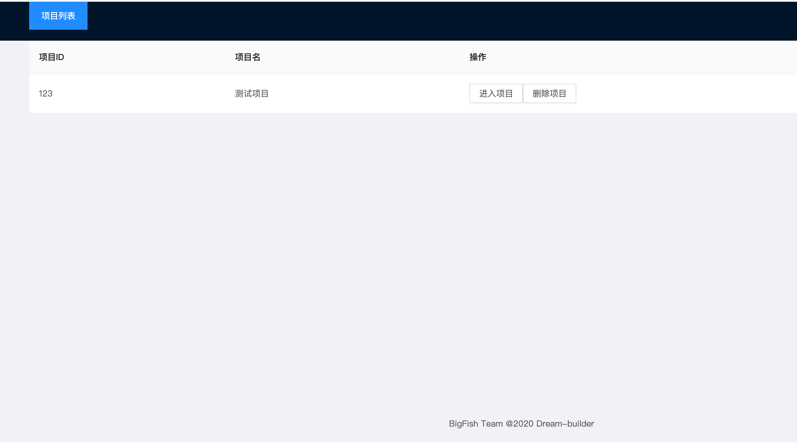
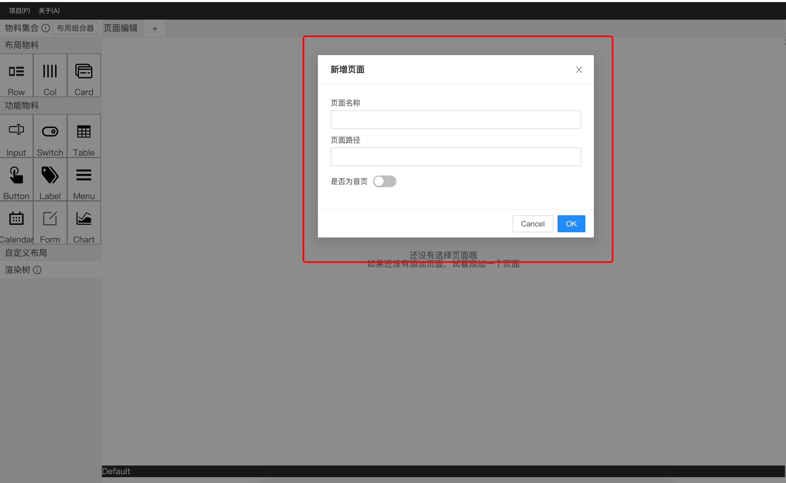
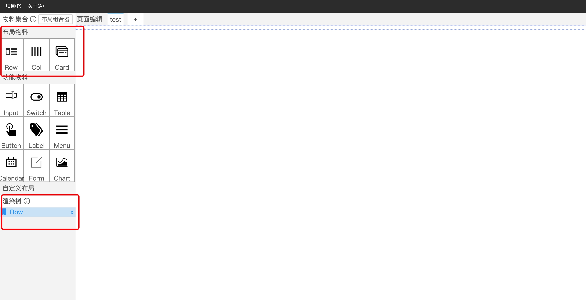
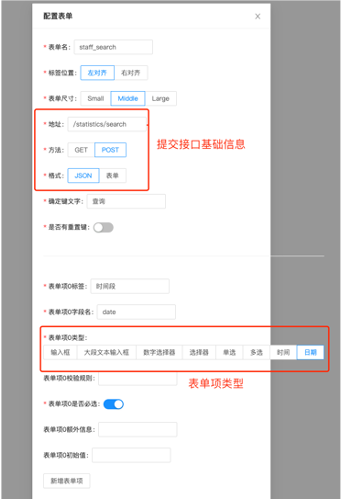
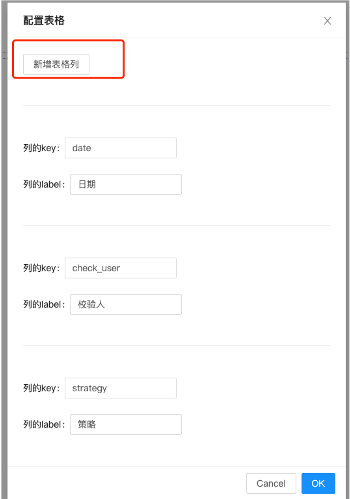
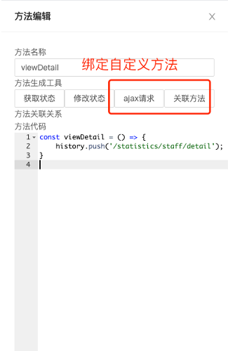
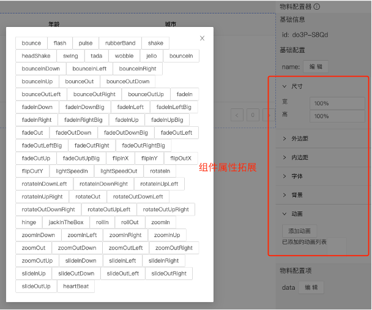
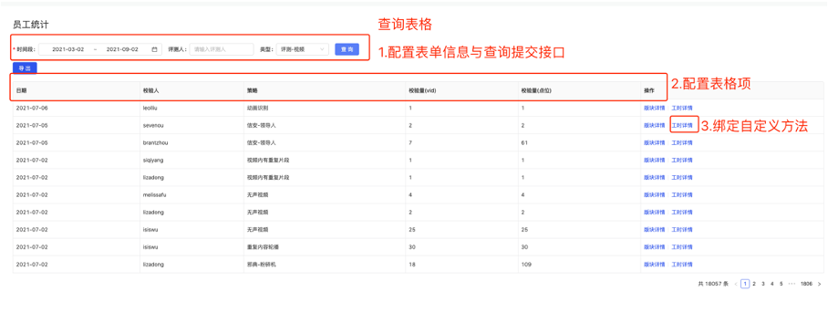
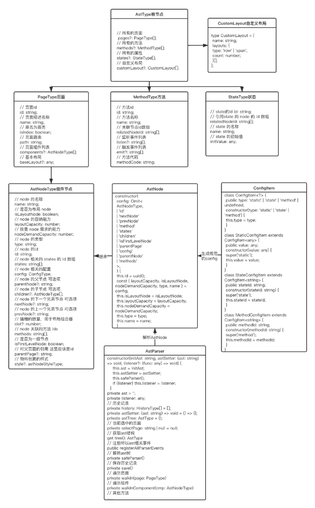
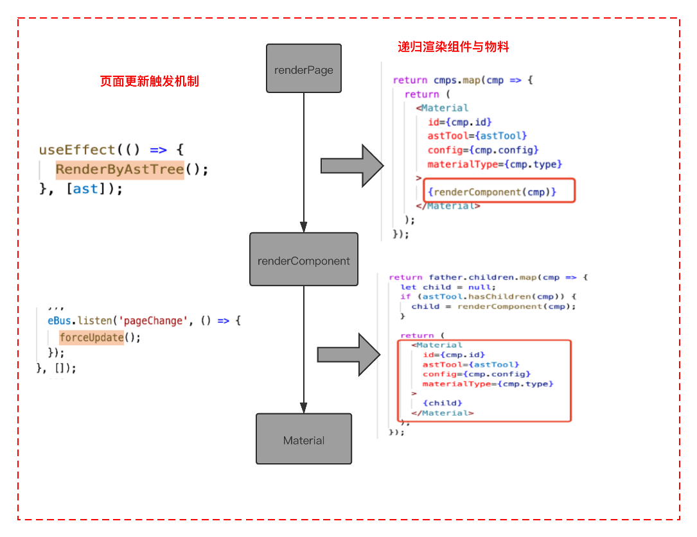

# dream-builder

## 轻量级中后台前端可视化搭建系统

- 面向中后台系统搭建
- 不限制任何 react 组件库，默认内置常用业务组件: [sui-components](https://github.com/tangzhirong/sui-components.git)、antd
- 开箱即用，提供丰富的组件、模版与物料
- 提供组件属性编辑和页面编排能力
- 轻量化，接入成本低，可拓展

# 页面搭建流程

## 创建项目



## 新建页面



## 页面布局

选择布局容器，使用栅格布局搭建页面骨架：



## 拖拽组件

拖拽组件到布局容器中

## 组件属性编辑

- 静态数据、属性配置：如表单项、表格列等
  
  
- 动态方法配置
  

## 组件属性拓展

提供组件样式、动画、自定义事件等拓展能力，可编写自定义动画、事件进行拓展：


## 生成页面，部署发布

- 生成页面：

```
yarn run build
```

- 部署发布：

编写发布脚本 deploy.js:

```
const path = require('path');
const DeployPush = require('deploy-http-push');

const project = 'test'; // 项目名称

DeployPush({
  receiver: '', // 部署服务器地址
  to: '', // 服务器静态资源存放路径
  targetDir: path.resolve(__dirname, '..', 'build', project), // 本地资源路径
});
```

执行部署脚本：

```
yarn run deploy
```

- 线上页面效果：



# Schema 协议规范

## 组件协议规范

- Name：组件名称
- Icon：组件图标
- Desc：组件描述
- IsLayout：是否为布局组件
- Material： 是否为物料
- NodeDC：节点类型
- Config：属性配置
  - Data：静态数据
  - State：状态
  - Event：事件
  - Method：方法
  - Style：样式
  - Animation：动画

## 页面协议规范

- AstType： 整个 AST 树的根节点，可包含多个 PageType 页面
- PageType： 记录单个页面，包含基本布局信息
- AstNodeType：记录单个组件，类似 React FiberNode 实现
- AstNode： 继承自 AstNodeType，和物料库进行关联，物料库类的配置由 ConfigItem 生成，传入 AstNode
- ConfigItem： 配置生成器，分为静态数据、状态和方法、事件配置、样式等配置
- AstParser： 解析和操作 AstNode，深度优先遍历 AST 树

页面结构描述 AST 树：


# 渲染引擎

- RenderByAstTree：AST 树结构变化时触发
- renderPage：渲染页面
- renderComponent：渲染页面的每个组件
- convertComposeLayoutToNestedNodes：布局组合转换为嵌套节点
- forceUpdate：eventBus 监听到 pageChange 事件时触发页面更新

渲染引擎执行原理：


# 高级特性

## 如何编写自定义组件

按照组件协议规范，使用装饰器定义组件信息与属性（在编辑器中可编辑、拓展），参考下面这个 Button 组件：

```
import React from 'react';
import 'reflect-metadata';
import { Button } from 'antd';
import { BaseMaterial } from '../base';
import { Icon, Desc, IsLayout, Material, NodeDC, Config } from '../../decorators';

@Icon(require('../../../imgs/button.png'), 'src')
@Desc('这个是button物料')
@IsLayout(false)
@Material()
@NodeDC(1)
export default class ButtonMaterial extends BaseMaterial {
  constructor(props: any) {
    super(props);
  }

  @Config()
  private value = '';

  @Config()
  private text = '';

  @Config()
  private onClick = () => {};

  instantiate() {
    return <Button {...this.props}>{(this.props as any).text}</Button>;
  }
}
```
